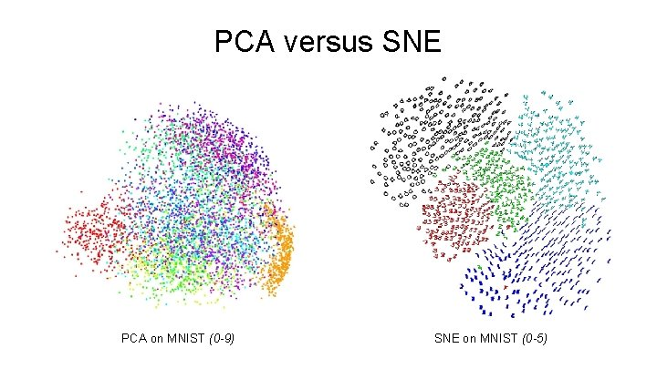

# Dimensonality reduction

Convert the high-dimensional data set $X = {x_1, x_2, ..., x_n}$ into two or three-dimensional data $Y = {y_1, y_2, ..., y_n}$ that can be displayed in a scatterplot.

The aim of dimensonality reduction is to preserve as much of the significant strcuture of the high-dimensional data as possible in the low-dimensional map. PCA and classical multidimensional scaling are traditional dimensonality reduction techniques, but are linear that focus on keeping the low-dimensional representations of dissimilar datapoints far apart.

# t-SNE visualization of high-dimensional data

## Sites, vídeos e papers:
- https://distill.pub/2016/misread-tsne/
- https://www.jmlr.org/papers/volume9/vandermaaten08a/vandermaaten08a.pdf
- https://lvdmaaten.github.io/tsne/
- https://towardsdatascience.com/an-introduction-to-t-sne-with-python-example-5a3a293108d1
- https://slidetodoc.com/principal-component-analysis-tdistributed-stochastic-neighbor-embedding-radu/
- https://www.youtube.com/channel/UCtYLUTtgS3k1Fg4y5tAhLbw
- https://jakevdp.github.io/PythonDataScienceHandbook/05.09-principal-component-analysis.html
- https://www.datacamp.com/community/tutorials/pca-analysis-r

## Sobre o  t-SNE
- t-SNE: Distributed Stochastic Neighbor Embedding
- O objetivo é pegar uma qautnidade de dados em um espaço high-dimensional e encontrar uma representação simples desses pontos em um espaço lower-dimensional (2D).
- O algorítimo é não-linear
- Tem um tuneable parameter, chamado "perplexity" que diz como balancear a atenção entre aspectos locais e globais dos seus dados. Na prática, é uma estimativa do número de vizinhos próximos que cada ponto tem.
- “The performance of SNE is fairly robust to changes in the perplexity, and typical values are between 5 and 50.”
- Esse parâmetro importa muito e, a depender do valor, muda-se a visualização por completo.
- Para o algorítimo operar apropriadamente o número perplexity precisa ser menor que o número de pontos no dataset. 
- Iterar até chegar em uma configuração estável dos dados na visualização. "? In our experience, the most important thing is to iterate until reaching a stable configuration."
- Se você vir um gráfico tSNE com formas “comprimidas” estranhas, é provável que o processo tenha sido interrompido muito cedo.
- Cluster sizes in a t-SNE plot mean nothing. Sizes mean bounding box measurements, not number of points.
- Distances between clusters might not mean anything
- Se usar dados gerados randomicamente de uma distribuição normal, verá que evenly distributed, with roughly equal spaces between points.
 
Stochastic Neighbor Embedding (SNE) starts by converting the high-dimensional Euclidean distances between datapoints into conditional probabilities that represents similarities. The similarity of datapoint $x_j$ to datapoint $x_i$ is the conditional probability, $p_{j|i}$ that $x_i$ would pick $x_j$ as its neighbor if neighbors were picked in proportion to their probability density under a Gaussian centered at $x_i$. For the low-dimensional counterparts $y_i$ abd $y_j$ of the high-dimensional datapoint $x_i$ and $x_j$, it is possible to compute a similar conditional probability, which we denote by $q_{i|j}$. 

If the map points $y_i$ and $y_j$ correctly model the similarity between the high-dimensional datapoints $x_i$ and $x_j$, the conditional probabilities $p_{j|i}$ and $q_{i|j}$ will be equal. Motivated by this observation, SBE aims to find a low-dimensional data representation that minimize the mismatch between $p_{i|j}$ and $q_{i|j}$. SNE minimize the sum of Kullbackt-Leibler divergences over all datapoints using a gradient descent method.. 

## Steps
1. Step 1, measure similarities between points in the high dimensional space. Think of a bunch of data points scattered on a 2D space (Figure 2). For each data point (xi) we’ll center a Gaussian distribution over that point. Then we measure the density of all points (xj) under that Gaussian distribution. Then renormalize for all points. This gives us a set of probabilities (Pij) for all points. Those probabilities are proportional to the similarities. All that means is, if data points x1 and x2 have equal values under this gaussian circle then their proportions and similarities are equal and hence you have local similarities in the structure of this high-dimensional space. The Gaussian distribution or circle can be manipulated using what’s called perplexity, which influences the variance of the distribution (circle size) and essentially the number of nearest neighbors. Normal range for perplexity is between 5 and 50.

2. Step 2 is similar to step 1, but instead of using a Gaussian distribution you use a Student t-distribution with one degree of freedom, which is also known as the Cauchy distribution (Figure 3). This gives us a second set of probabilities (Qij) in the low dimensional space. As you can see the Student t-distribution has heavier tails than the normal distribution. The heavy tails allow for better modeling of far apart distances.


3. The last step is that we want these set of probabilities from the low-dimensional space (Qij) to reflect those of the high dimensional space (Pij) as best as possible. We want the two map structures to be similar. We measure the difference between the probability distributions of the two-dimensional spaces using Kullback-Liebler divergence (KL). I won’t get too much into KL except that it is an asymmetrical approach that efficiently compares large Pij and Qij values. Finally, we use gradient descent to minimize our KL cost function.


## PCA x t-SNE

t-SNE difere do PCA por preservar apenas pequenas distâncias entre pares ou semelhanças locais, enquanto o PCA se preocupa em preservar grandes distâncias entre pares para maximizar a variância


## First step

Analisar se as features possuem variância maiores que 0. Caso não, dropar.

- Usar sns.pairplot(hue = '', diag_kind = 'hist')
- Feature selection
- Feature extraction
- from sklearn.manifold import TSNE


# Como detectar recursos de baixa qualidade e removê-los?

Modelos tendem a se ajustar mal em dados de high-dimensional. A solução é reduzí-la, porém o que reduziremos?

Por que modelos se ajustam demais (overfitting)? Ele memoriza as informações e não generaliza. O modo de ver se deu overfitting é vendo se a *sklearn.metrics.accuracy_score* do treino foi muito maior que a do teste. 

Para cada feature (colunas) adicionada também precisamos aumentar o número de observações (linhas). Actually, to avoid overfitting, the number of observations should increase exponentially with the numbers o features.

## Features with missing values oe little variance
Features com baixa variação são tão semelhantes que contém oucas informações que você possa analisar. 

No geral, utilizamos `VarianceThreshold`.

```python

from sklearn.feature_selection import VarianceThreshold

sel = VarianceThreshold(threshold = 1) ## minminum variance of datas
sel.fit(df)

mask = sel.get_support()  ## retunr a boolean

reduce_df = df.loc[:, mask] ## choose only mask
```

No entanto, essas variações nem sempre são interpretáveis facilmente, para isso temos que normalizar os dados antes de aplicar `VarianceThreshold`, pois em alguns data set há features de diferentes grandezas, assim, uma feature com dados de maior grandeza tem maior variação. Veja o boxplot dos dados para analisar isso.

```python
## --- continue
sel = VarianceThreshold(threshold = 0.005) # reduzimos o limite de variância
sel.fit(df / df.mean()) # normalization

## --- aplicar no df
```
\* a redução do threshold para um número X deve ser feita de acordo com a visualização dos dados, por exemplo, com `normalized_df.var()`, e analisar as menos variâncias.

## Pairwise correlation

> `sns.pairplot(df, hue = 'feature_')`

Como os recursos se relacionam entre si? São muito ou pouco correlacionados? Para quantificar essa correlação utilizamos do coeficiente de correlação, $R^2$, que varia de -1 a 1 (perfeitamente correlacionado negativamente à perfeitamente correlacionado positivamente). Para calcular usamos `df.corr()`. Para visualizar, usamos os heatmap.

```python

sns.heatmap(df.corr(), fmt = '.2f', annot = True, linewidths = 1)
```

Para melhorarmos a visualização sem repetição de dados, temos que criar uma máscara booleana e uma matriz.

```python
corr = df.corr()

mask = np.triu(np.ones_like(corr, dtype = bool)) # matriz de booleanos

# para visualizar o heatmap

sns.seaborn(df.corr(), mask = mask, ...)
```

## Removing highly correlated features
Remover uma das features, de duas altamente correlacionadas, pois passam a mesma informação. A técnica só deve ser utilizada se você conhecer muito bem os dados.

```python
# create positive correlation matrix
corr_matrix = df.corr().abs()

# create and apply mask
mask = np.triu(np.ones_like(corr_df, dtype = bool))
tri_df = corr_matrix.mask(mask)

# find columns that meet threshold
to_drop = [c for c in df.columns if any(tri_df[c] > 0.95) ] # 0.95 -- min correlation in tri_df

# drop those columns
reduce_df = df.drop(to_drop, axis = 1)
```